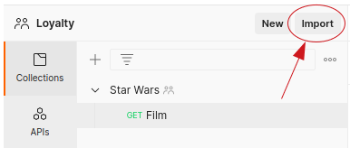
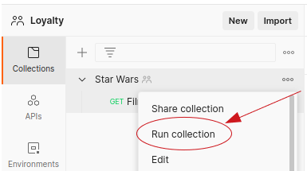

# k6 vs JMeter vs Gatling

PoC para comparar el trabajo que realiza k6, JMeter y Gatling en una prueba al [API de Star Wars](https://swapi.dev).

**Bonus:** Se realiza la prueba con Postman para verificar y comparar su funcionamiento.

## Características

|Característica|k6|JMeter|Gatling|Postman|
|---|---|---|---|---|
|Permite ejecutar pruebas de carga|<ul><li>[x] Si</li></ul>|<ul><li>[x] Si</li></ul>|<ul><li>[x] Si</li></ul>|<ul><li>[x] Si</li></ul>|
|Ofrece versionado de código `1`|<ul><li>[ ] No</li></ul>|<ul><li>[ ] No</li></ul>|<ul><li>[ ] No</li></ul>|<ul><li>[x] Si</li></ul>|
|Tiene entorno de desarrollo|<ul><li>[ ] No</li></ul>|<ul><li>[x] Si</li></ul>|<ul><li>[ ] No</li></ul>|<ul><li>[x] Si</li></ul>|
|Lenguaje de programación|JavaScript|<ul><li>[ ] No, se programa el script en el IDE usando elementos gráficos. `2`</li></ul>|Scala|JavaScript|

* `1` Se puede hacer de forma independiente usando Git y versionando los archivos. Solo Postman ofrece en su mismo IDE un versionado de código para trabajar en equipo.
* `2` El script resultante es un archivo XML con extensión `.jmx`.

## Tabla comparativa

|Tecnología|Ventajas|Desventajas|
|---|---|---|
|k6|- Utiliza JavaScript lo que lo hace muy liviano.<br/>- Es fácil de aprender.| |
|JMeter|- Provee todas las herramientas para hacer pruebas de carga con muchas funcionalidades.<br/>- Tiene su propio IDE.<br/>- Es posible ejecutar los scripts desde el IDE o desde CLI.|- Es necesario saber utilizar el IDE.<br/>- Es posible manipular el XML resultante pero es bastante complejo, hay que tener mucho conocimiento.<br/>- Solo ofrece el cliente de escritorio.|
|Gatling|- Utiliza Scala.<br/>- Es fácilmente integrable con herramientas de construcción como Gradle o Maven.<br/>- Utiliza la JVM, lo cuál permite que corra en cualquier ambiente que acepte Java.|- La configuración del proyecto puede ser un tanto verbose (En comparación con k6).|
|Postman|- Es una herramienta muy utilizada.<br/>- Tiene su propio IDE.<br/>- Utiliza JavaScript.<br/>- Ofrece la posibilidad de trabajar en equipos, versionar cambios, colaboración, etc.<br/>- Fácil de utilizar.<br/>- Ofrece un cliente de escritorio y un cliente web.|- La versión gratuita solo permite hasta 3 miembros en el equipo.|

**Nota:**
* Todas las tecnologías son gratis. Solo Gatling y Postman ofrecen un plan premium o por suscripción (Son adicionales) para trabajos más pesados.
* Todos los scripts resultantes son integrables con Jenkins u otras herramientas de CI/CD.

## k6

[k6](https://k6.io) es un SaaS que permite realizar pruebas de carga. Es muy liviano y fácil de utilizar.

Este ejercicio está hecho usando JavaScript.

### Uso

Ejecutar:

```bash
cd k6
k6 run star-wars.js
```

## JMeter

[JMeter](https://jmeter.apache.org) es una herramienta que permite realizar pruebas de carga. Tiene un cliente que se ejecuta localmente y una interfaz gráfica donde es posible agregar las pruebas HTTP y sus validaciones.

### Uso

Descargar [JMeter](https://jmeter.apache.org/download_jmeter.cgi) y correr el script [Star Wars test plan.jmx](https://github.com/juanalvarez123/k6-jmeter-gatling-poc/blob/master/jmeter/Star%20Wars%20test%20plan.jmx).

### Componentes de JMeter

* HTTP Request: Obtiene la información de un planeta.
* Response Assertion: Valida textualmente que el nombre del planeta (junto con el atributo) venga en la respuesta.
* JSON Assertion: Valida por estructura que un atributo venga en la respuesta y tenga un valor.
* View results tree: Resultados de las peticiones HTTP y sus validaciones.
* Assertion Results: Resultados de las validaciones. Si no hay errores muestra un reporte vacío.

## Gatling

Tomado de [gatling-gradle-plugin-demo](https://github.com/gatling/gatling-gradle-plugin-demo). [Gatling](https://gatling.io) es una solución open-source para hacer pruebas de carga.

Este ejercicio está hecho usando Scala.

### Uso

* Correr todas las simulaciones de Gatling:

```bash
cd gatling
./gradlew gatlingRun
```

* Correr una simulación sencilla por su FQN (fully qualified class name):

```bash
cd gatling
./gradlew gatlingRun-main.StarWarsSimulation
```

## Postman (Bonus)

[Postman](https://www.postman.com) es una herramienta que permite realizar pruebas a APIs Rest. Las pruebas pueden ser sencillas (Un simple requests HTTP) o de carga (Programar todos los request de una colección para que corran juntos).

Para cada request HTTP se tiene la posibilidad de escribir pruebas en JavaScript. 

La [validación de schema](https://postman-quick-reference-guide.readthedocs.io/en/latest/schema-validation.html) que ofrece es bastante completa y fácil de utilizar. 

### Uso

1. Descargar Postman.
2. Crear un Workspace.
3. Importar la colección [Star Wars.postman_collection.json](https://github.com/juanalvarez123/k6-jmeter-gatling-poc/blob/master/postman/Star%20Wars.postman_collection.json):

   

4. Correr la colección:

   
